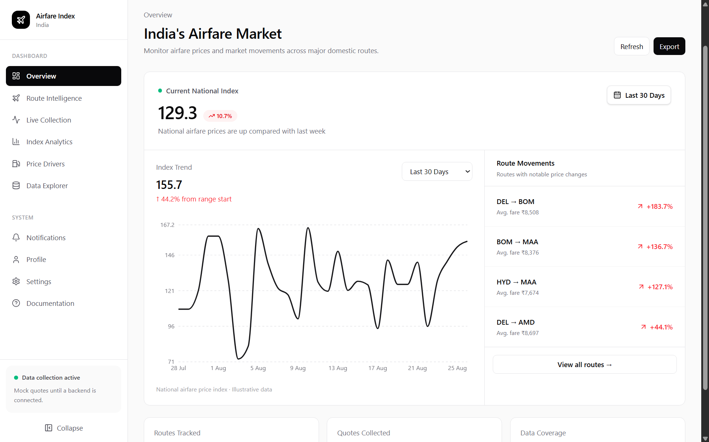
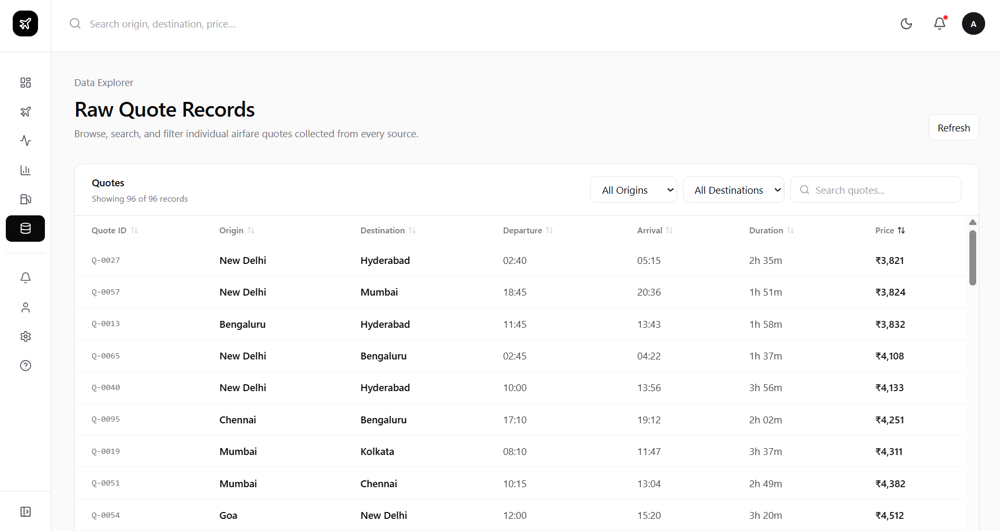
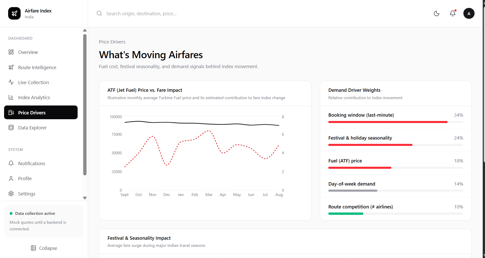

# AIR-FARE-INDEX

## Overview

AIR-FARE-INDEX is a project focused on developing an Airfare Price Index to analyze and track changes in domestic air travel fares across India.

The project aims to provide a centralized platform for collecting, processing, and visualizing airfare data to identify price trends and patterns.

## Project Status

🚧 **Work in Progress**

The project is currently under active development, with the frontend, backend, data collection, and analysis components being developed and integrated.

## Key Components

- Airfare data collection and processing
- Airfare Price Index calculation and analysis
- Route-wise fare insights
- Price trend visualization
- Data exploration and analytics
- Dashboard for monitoring airfare patterns

## Preview

### Dashboard

__

### Data Explorer

### Price Trends

## Technology

The project uses a combination of frontend, backend, data processing, and database technologies to build the complete system.

## Team

Developed as a collaborative project for the study and analysis of airfare pricing in India.

---

**AIR-FARE-INDEX** — Tracking and understanding airfare trends across India.